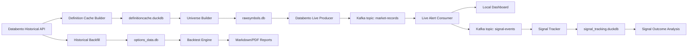

# Supreme Options Bot Research System

An end-to-end options-market research system for collecting OPRA option data, building a live subscription universe, calculating anomaly signals, serving a local dashboard, tracking signal outcomes, and replaying the same logic through historical backtests.

This project is a research and data-engineering system, not a production trading bot. The final result was intentionally honest: the z-score anomaly strategy found real option price expansions, but portfolio-level edge was not strong enough after realistic exits and misses. The engineering framework is the main artifact.

## Demo Video

[](https://youtu.be/iFoRqB5RXG8)

Watch the project walkthrough: [Live Options Market Research System](https://youtu.be/iFoRqB5RXG8)

## What This Project Shows

- Historical market-data engineering with Databento OPRA data, DuckDB storage, retry logic, batching, request guards, and cached definitions.
- Live event processing with Kafka, a Databento live producer, a stateful consumer, alert generation, and a local dashboard.
- Quant research workflow: baseline construction, z-score signal design, signal tracking, outcome labeling, MFE/MAE measurement, and backtest reporting.
- Practical research discipline: the system tested the idea, measured it, found the limits, and preserved the learnings.

## Architecture



## Core Components

| File | Purpose |
| --- | --- |
| `databentodatabasebackfillworkingversion.py` | Builds historical option quote, trade, rolling volume, and open-interest data in DuckDB. |
| `definitions_cache_builder.py` | Pulls and caches OPRA definition data used to map option chains to raw Databento symbols. |
| `universe_builder.py` | Builds the live option universe from cached definitions and underlying prices. |
| `databento_live_producer.py` | Subscribes to Databento live option records and publishes normalized events to Kafka. |
| `live_alert_consumer.py` | Consumes Kafka records, maintains live option state, calculates z-scores, sends alerts, and serves dashboard state. |
| `live_dashboard_server.py` | Local browser dashboard for subscribed contracts, quotes, rolling volume, baselines, and alerts. |
| `signal_tracker.py` | Separately consumes signal events and tracks post-signal outcomes without sharing DuckDB write connections. |
| `backtest_combined_alerts.py` | Replays historical data through live-style signal logic and produces research reports. |
| `one_year_backfill_and_backtest.py` | Safe wrapper for max-one-year historical backfill plus backtest replay. |
| `LEARNINGS.md` | Research notes and conclusions from completed strategy iterations. |

## Signal Logic Tested

The final strict backtest tested this sequence:

```text
volume-dominance rule passes
quote confirms within 3 minutes
option mid is up at least 3% and at least 0.01
alert is triggered by quote update
first alert only for that option contract
contract is OTM1/OTM2
decay bucket is HIGH/EXTREME
underlying confirms with a 15-minute breakout
exit at underlying fail or 15 minutes
```

The research conclusion was not that this should be traded directly. The conclusion was that anomaly detection can identify real short-lived option expansions, but the edge is highly exit-sensitive and not strong enough by itself.

## Latest Research Snapshot

The final strict run produced:

| Metric | Result |
| --- | --- |
| Volume-rule candidates | 4,887 |
| Final alerts after quote + underlying confirmation | 173 |
| Signals with at least +10% opportunity | 115 / 173 |
| Strategy exit average return | +4.20% |
| Strategy exit median return | +1.41% |
| Estimated deployed-premium return with best tested exit | About +3.5% |

Interpretation: the signal found real moves, but the returns were not strong enough relative to complexity, risk, and execution sensitivity. The project is valuable because it reached that conclusion with data instead of guessing.

## Setup

Create a virtual environment and install dependencies:

```bash
python3 -m venv .venv
.venv/bin/pip install -r requirements.txt
```

Create local secrets:

```bash
cp .env.example .env
```

Required for Databento workflows:

```text
DATABENTO_API_KEY
```

Optional for email alerts:

```text
SMTP_USERNAME
SMTP_PASSWORD
ALERT_EMAIL_TO
```

Local DuckDB files, generated reports, batch downloads, and secrets are intentionally ignored by git.

## Historical Backtest

Run against already-populated local data:

```bash
.venv/bin/python one_year_backfill_and_backtest.py --skip-backfill
```

Run backfill plus backtest:

```bash
.venv/bin/python one_year_backfill_and_backtest.py
```

Safety behavior:

```text
Databento historical requests are guarded to stay within the max one-year lookback.
yfinance intraday underlying confirmation is limited by intraday availability.
Reports are written to backtest_reports/.
```

Run a smaller parent-only test:

```bash
.venv/bin/python one_year_backfill_and_backtest.py --skip-backfill --parents AAPL
```

## Live Pipeline

Start Kafka separately first. Then run each long-lived process in its own terminal:

```bash
.venv/bin/python definitions_cache_builder.py
.venv/bin/python universe_builder.py
.venv/bin/python databento_live_producer.py
.venv/bin/python live_alert_consumer.py
.venv/bin/python signal_tracker.py
```

Open the local dashboard:

```text
http://127.0.0.1:8765
```

The live consumer owns in-memory dashboard state. The signal tracker writes to a separate DuckDB file so it does not interfere with the live consumer's state.

## Tests

Focused unit tests for the underlying-confirmation backtest logic:

```bash
.venv/bin/python tests/test_underlying_confirmation_backtest.py
```

Basic syntax check:

```bash
.venv/bin/python -m py_compile backtest_combined_alerts.py one_year_backfill_and_backtest.py
```

## Repository Notes

This repo intentionally excludes:

- Databento and yfinance-derived local databases.
- Generated backtest reports and PDFs.
- `.env` secrets.
- Batch download artifacts.

The codebase is designed to demonstrate the full research workflow. It is not financial advice and is not a production execution system.
